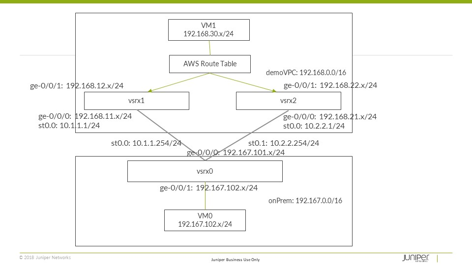

# IPSEC/vsrx Redundancy Solution in AWS

## Problem Statement
* IPsec redundancy with dual vSRX is one of the critical customer requirements.
* Existing Chassis Cluster/ High Availability solutions rely on L2 layer for session-sync and data failover
* Public clouds such as AWS, Azure, etc. do not support L2 traffic or Multicast
* Traditional methods of session sync will not work in public cloud environments

## Design Principles/ considerations
* Reliability:
    * Tunnels redundancy
    * Firewall nodes redundancy
    * Availability Zones/Geo-redundancy 
    * High Availability Networking
* Leverage AWS services
    * CloudWatch for health-check 
    * Lambda/Server-less compute for VPC internal route change
    * Does not need any new effort from Engineering
    * Cost effective
* Failover Factors
    * Instance Status: Stopping, pending, shutting down
    * CloudWatch metrics: vSRX CPU utilization, Interface Input and Output PPS and other metrics…

## DEMO
 * Topology
    

 * [Demo Video](https://drive.google.com/open?id=1w8zJaqAa-b_mqv4CNXRkK8JT-uKlbs6d)
 * [Presentation/Implementation](AWS_IPSec_Redundancy.pptx)